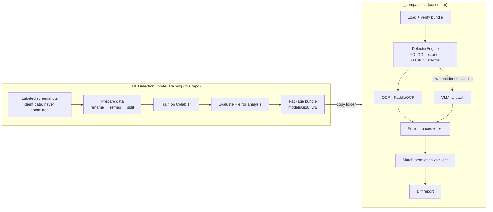

# Architecture

## Two repos, one boundary



The **only** thing that crosses the line is the bundle folder. The consumer
never imports code from here, never reads the raw data, never trains.
Details: `docs/INTERFACE.md`.

## Inside this repo — the data and training pipeline

```
data/raw/            103 screenshots + 22-class Label Studio labels (read-only)
   │  scripts/rename_dataset.py
   ▼
data/renamed/        same files, stable ids ss001..ss103
   │  scripts/audit_labels.py        (report only, changes nothing)
   │  scripts/remap_labels.py        22 → 16 classes by NAME,
   │                                 then applies config/label_corrections.yaml
   ▼
data/labels_16/      16-class labels            config/classes_16.txt
   │  scripts/draw_labels.py         (visual check → data/preview/)
   │  scripts/split_dataset.py       class-aware 83/20 split, seed 42
   ▼
ds/ + config/ui.yaml (+ config/folds/ for k-fold)
   │  scripts/train.py  or  notebooks/train_colab.ipynb
   ▼
runs/detect/<run>/   weights/best.pt, results.csv, run_meta.json
   │  scripts/evaluate.py            per-class table, confusion matrix, worst images
   │  scripts/error_analysis.py      missed / false positive / wrong class / bad box
   ▼
   │  scripts/package_model.py       (Phase 9 — not written yet)
   ▼
models/ui16_vN/      best.pt, model_card.json, classes_16.txt, gt_detections.json
   │  scripts/verify_bundle.py       (Phase 9 — not written yet) handoff gate
   ▼
handoff to ui_comparision
```

## Where settings live

| Setting | File |
|---|---|
| Model, imgsz, epochs, batch, augmentation | `config/train.yaml` |
| Class list (binding order) | `config/classes_16.txt` (written by the remap) |
| Label fixes | `config/label_corrections.yaml` |
| Dataset paths | `config/ui.yaml`, `config/folds/` — generated, machine-specific, not committed |

No thresholds or training numbers are hard-coded in scripts.

## Folder map

| Folder | Committed? | Purpose |
|---|---|---|
| `scripts/` | yes | One script per phase |
| `config/` | yes (except generated split files) | All settings |
| `notebooks/` | yes | Colab training notebook |
| `docs/` | yes | These documents |
| `tests/` | yes | `test_remap.py` |
| `models/` | cards and text only, never `.pt` | Published bundles |
| `data/`, `ds/`, `runs/` | **never** | Client images, splits, training output |

## Hardware split

| Job | Where | GPU |
|---|---|---|
| Full training | Google Colab | Tesla T4, 16 GB |
| Evaluation, packaging, verification | Local | GTX 1070, 8 GB (`ui_compare_v2` container) |
| Inference in production use | `ui_comparision`, local | GTX 1070, 8 GB |

If a local job runs out of GPU memory, lower settings in this order:
`batch` → `imgsz` → `freeze=10`.
